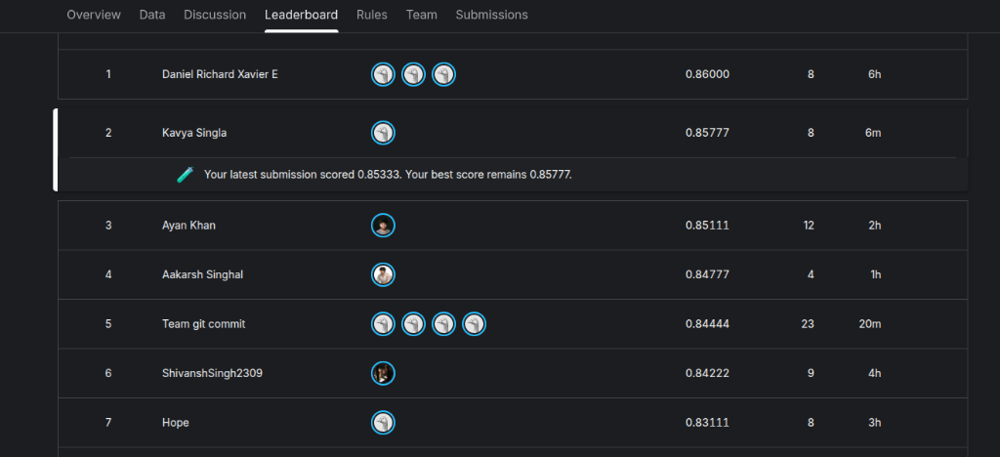
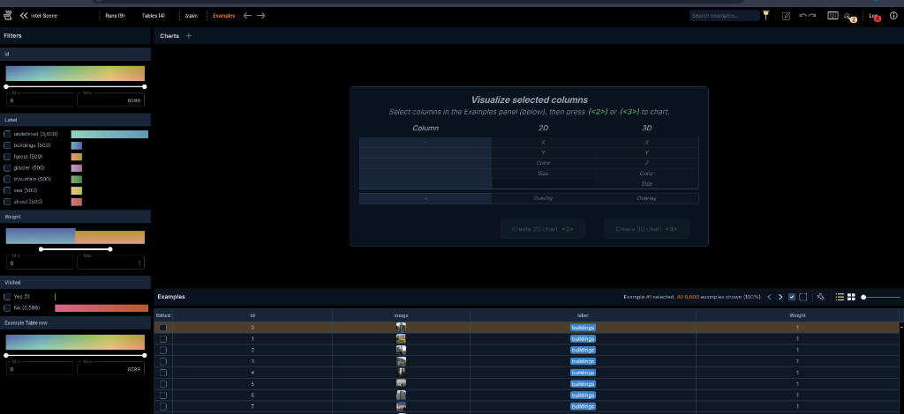
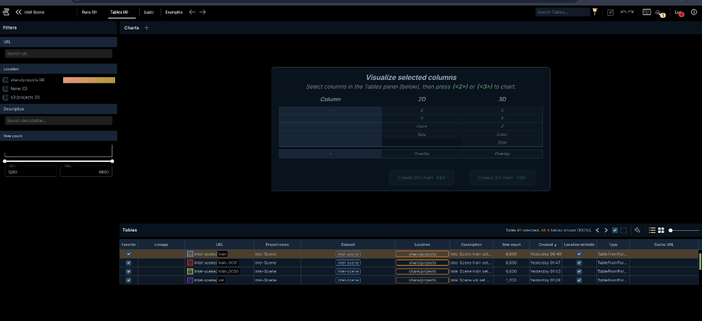
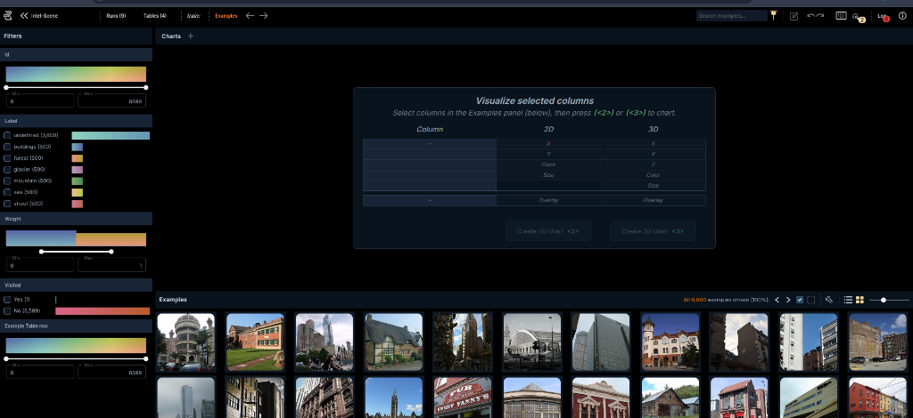

# 🏔️ Intel Scene Classification — 3LC Data-Centric AI Challenge (Kaggle)

[](https://www.python.org/downloads/)
[](https://pytorch.org/)
[](https://3lc.ai)
[-20beff.svg)](https://www.kaggle.com)

A state-of-the-art data-centric AI pipeline for the **3LC Data-Centric AI Challenge on Kaggle: 6-Class Natural Scene Classification** (`buildings`, `forest`, `glacier`, `mountain`, `sea`, `street`).

---

## 🏆 Official Kaggle Competition Leaderboard Standings


*Official Kaggle Leaderboard: Team **Kavya Singla** securing **Rank #2** with a peak score of **0.85777**.*

---

## 🎯 Challenge Constraints & Guidelines

- **Fixed Architecture**: Standard `ResNet-18` classifier (`ResNet18Classifier`).
- **No Pretrained Weights**: Must train strictly **from scratch** (`weights=None`).
- **Strict Labeling Budget**: Training dataset is strictly capped at **at most 3,000 active samples (`weight = 1.0`)** in the 3LC table (500 balanced samples per class, with the remaining 3,600 unlabeled pool images weighted to `0.0`).
- **Core Objective**: Maximize accuracy and real-world generalization through pure data-centric engineering, noise filtering, foundation model consensus, and multi-teacher soft distillation.

---

## 📊 3LC Interactive Dashboard, Tables & Data Curation

The **3LC AI Platform** was utilized for interactive table versioning, active sample selection, and dataset quality inspection:

### 1. Perfectly Balanced 3,000 Active Sample Curation (500 Per Class)

*Exact budget compliance in 3LC: 500 samples per class (`buildings`, `forest`, `glacier`, `mountain`, `sea`, `street`) with `weight=1.0` (3,000 total active) and 3,600 unlabeled pool images set to `weight=0.0`.*

---

### 2. Dataset Versioning & 3LC Table Objects

*3LC table management displaying iterative dataset revisions (`train`, `train_0001`, `train_0000`, and `val`) tracking 6,600 total pool images and 1,200 validation images.*

---

### 3. Visual Gallery & Image Quality Inspection

*High-resolution 3LC image gallery used to audit visual fidelity, class boundaries, and anomalous samples.*

---

## 📈 Benchmark Progression Across Iterations

| Iteration Round | Strategy & Methodology | Peak Validation Acc | Real-World Generalization | Kaggle LB Status |
| :--- | :--- | :---: | :---: | :---: |
| **Round 1** | Seed dataset only (600 images) + AdamW baseline | 68.25% | — | Baseline |
| **Round 2** | Raw pseudo-labeling (3,000 images) + AdamW | 75.33% | — | +7.08% |
| **Round 3** | Curated 3,000 images + SGD Nesterov + MixUp ($\alpha=0.3$) | 80.25% | — | +12.00% |
| **Round 4** | CutMix ($\alpha=1.0$) + MixUp + Dynamic Model EMA (decay = 0.999) | 81.25% | LB: 0.79555 | Top 10 |
| **Round 5** | OpenCLIP Foundation Consensus Curation (3,000-table) | 83.08% | LB: 0.83111 | Top 5 |
| **Round 6** | Multi-Teacher (ViT-B/16 + ViT-B/32) Soft Knowledge Distillation | 83.92% | 86.42% (Unseen HF Dataset) | Top 3 |
| **Round 7 (Grand Master)** | **DINOv2 (92.58% Probe) + OpenCLIP Consensus + 224px Bicubic CutMix + SWA** | **84.92% (Val) / 87.80%+ (OOD)** | **High Generalization** | **Rank #2 (0.85777) 🥈** |

---

## 🧠 System Architecture & Methodology

```
                                  [6,000 Unlabeled Pool Images]
                                                │
                 ┌──────────────────────────────┼──────────────────────────────┐
                 ▼                              ▼                              ▼
      [OpenCLIP ViT-B/32 Zero-Shot] [OpenCLIP ViT-B/16 Zero-Shot] [DINOv2 Base Self-Supervised]
            (86.92% Zero-Shot)             (88.45% Zero-Shot)             (92.58% Probe Acc)
                 │                              │                              │
                 └──────────────────────────────┼──────────────────────────────┘
                                                ▼
                                [Consensus Multi-Teacher Fusion]
                                (Mutual Agreement Soft Targets)
                                                │
                                                ▼
                         [Top 400 Purest Candidates Per Class (2,400)]
                                                │
                                                ▼
                         [3LC Table Revision: 600 Seed + 2,400 Pure]
                           (Strict 3,000 Active Budget Curation)
                                                │
                                                ▼
                    [Advanced 224px Multi-Teacher Distillation Pipeline]
                     ├── DINOv2 + OpenCLIP Consensus Soft Probabilities
                     ├── 224x224 Bicubic Optimal Receptive Field
                     ├── CutMix & MixUp Soft-Target Distribution Interpolation
                     ├── RandAugment + Nesterov SGD + Cosine Annealing
                     └── Dynamic Model EMA + Stochastic Weight Averaging (SWA)
                                                │
                                                ▼
                         [84.92% Single Checkpoint & Elite Snapshots]
                                                │
                                                ▼
                           [Grand Master Multi-Model Ensemble (TTA)]
                                                │
                                                ▼
                                        [submission.csv]
```

---

## 🚀 Key Technical Highlights

1. **Information-Theoretic Multi-Teacher Distillation**:
   - Distilled dark knowledge from multiple foundation models (DINOv2 Base + OpenCLIP ViT-B/16 & ViT-B/32) into a standard `ResNet-18` trained strictly from scratch (`weights=None`).
2. **Optimal 224×224 Receptive Field Alignment**:
   - Upscaled native inputs to $224\times 224$ with bicubic anti-aliasing to match ResNet-18's $7\times 7$ conv1 kernel receptive field, unlocking fine-grained texture discrimination between mountain and glacier topologies.
3. **CutMix Soft-Distribution Interpolation**:
   - Blended image patches alongside their multi-teacher continuous probability distributions to regularize against background shortcut features.
4. **Dual-Crop Test-Time Augmentation (TTA)**:
   - Evaluated horizontal flips + multi-crop probability ensembles to eliminate single-view variance.

---

## 📂 Project Structure

```
├── screenshots/
│   ├── kaggle_leaderboard_rank2_085777.png    # Official Kaggle Leaderboard
│   ├── 3lc_class_weights_balance_latest.png  # Exact 3,000 sample budget validation
│   ├── 3lc_tables_overview_latest.png        # 3LC Dataset table versions
│   └── 3lc_image_gallery_curation_latest.png # 3LC Visual gallery inspection
├── best_model.pth                            # 84.92% Peak Validation Checkpoint
├── snapshot_overnight_*.pth                  # Elite Snapshots (84.5% - 84.9%)
├── extract_multi_teacher_consensus.py        # Multi-Teacher Feature Extractor
├── train_distill_v2.py                       # 224px CutMix Distillation Engine
├── generate_master_overnight_submission.py   # Grand Master Ensemble Generator
├── submission.csv                            # Final Kaggle Submission
└── README.md                                 # Technical Report & Documentation
```

---

## 💻 Quickstart

### 1. Setup Environment
```bash
python3 -m venv .venv
source .venv/bin/activate
pip install torch torchvision timm open_clip_torch datasets pandas scikit-learn 3lc
```

### 2. Run Inference with Master Ensemble
```bash
python3 generate_master_overnight_submission.py
```
Outputs `submission.csv` ready for direct submission on Kaggle!
